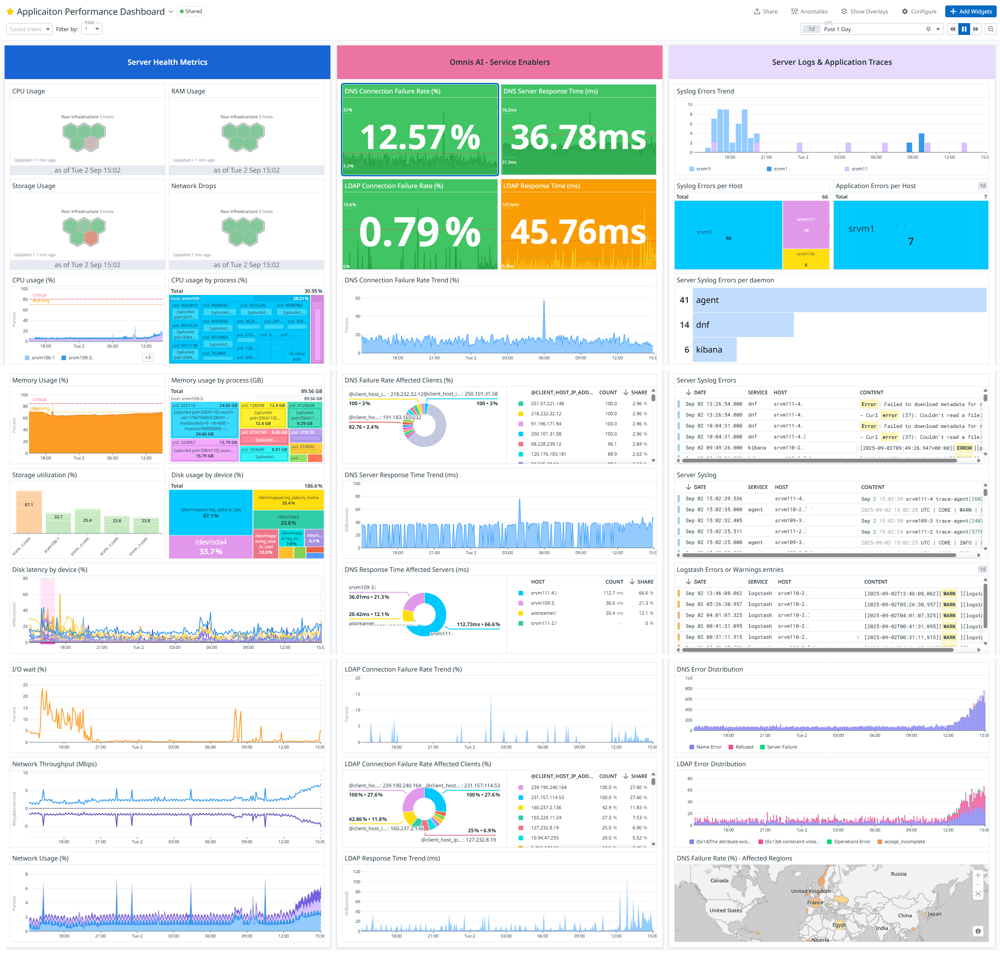

# Datadog – DNS & LDAP Monitoring

## Overview

An end-to-end observability solution for monitoring DNS and LDAP services, combining infrastructure health, service-level KPIs, logs, application traces and geographic analysis.

The solution used **two complementary data collection paths**:

* **Datadog Agent** for server health metrics, logs and application traces
* **Logstash** for processing and forwarding NETSCOUT probing data from Kafka to Datadog

---

## Observability Architecture

```text
                         ┌──────────────────────────┐
                         │        Datadog           │
                         │                          │
                         │ Metrics · Logs · Traces  │
                         │ Dashboards & Analytics   │
                         └────────────┬─────────────┘
                                      │
                    ┌─────────────────┴─────────────────┐
                    │                                   │
             Datadog Agent                         Logstash
                    │                                   │
          ┌─────────┼─────────┐                         │
          │         │         │                         │
       Health     Server   Application          Kafka Topic
       Metrics     Logs       Traces                  │
                                                       │
                                               NETSCOUT Probes
                                                       │
                                              Probing / Test Data
```

---

## Dashboard



> **Note:** The dashboard screenshot has been anonymized and contains no customer-sensitive or confidential information.

---

## Use Case

The dashboard was designed to provide a **single operational view of DNS and LDAP service health**, combining infrastructure, service performance and detailed troubleshooting information.

The dashboard is divided into three main sections.

### 1. Infrastructure Health

Server health information was collected using the **Datadog Agent**.

The dashboard provides an overview of the underlying DNS and LDAP server health, including:

* RAM utilization
* Disk utilization
* Partition usage
* Network-related KPIs
* Server health indicators

This provides infrastructure context when investigating service degradation.

### 2. DNS & LDAP Service KPIs

NETSCOUT probing data was collected from test transactions and processed through the **Kafka → Logstash → Datadog** pipeline.

The dashboard provides service-level KPIs including:

* Response time
* Failure rate
* Failure trends
* Worst clients affected by failures
* Servers with the highest response times
* Service performance trends

This allows technical teams to identify degraded services and determine which clients or servers are most affected.

### 3. Logs, Traces & Geographic Analysis

**Datadog Agent** was used to collect server logs and application traces.

The dashboard combines this information with the NETSCOUT probing data to provide deeper troubleshooting capabilities, including:

* Server logs
* Application traces
* Failure analysis
* Geographic distribution of affected traffic
* Regional failure-rate analysis

The geographic view helps correlate service failures with the location of affected users or traffic.

---

## Data Collection & Processing

### Datadog Agent

The Datadog Agent was deployed on the monitored servers and used for:

* Infrastructure health metrics
* Server logs
* Application traces

This provided the infrastructure and application observability layer.

### NETSCOUT Probes → Kafka → Logstash → Datadog

NETSCOUT probes generated test/probing data that was stored in a Kafka topic.

Logstash was used to subscribe to the Kafka topic, process the data and forward it to Datadog.

As part of the Logstash processing pipeline, I implemented several data transformations and enrichments.

#### GeoIP Enrichment

I enabled GeoIP enrichment for **server IP addresses**, allowing probing data to be analyzed geographically in Datadog.

#### Timestamp Transformation

The source data did not use the required timestamp format by default. I implemented timestamp transformation in Logstash to convert the timestamps into **ISO 8601 format** before sending the data to Datadog.

---

## My Contribution

I designed and implemented the monitoring solution across the data collection, processing and observability layers, including:

* Integrating NETSCOUT probing data with Kafka and Logstash
* Troubleshooting and resolving data-processing issues
* Implementing GeoIP enrichment
* Transforming timestamps into ISO 8601 format
* Forwarding processed NETSCOUT data to Datadog
* Working with Datadog Agent for metrics, logs and traces
* Designing the DNS and LDAP monitoring dashboard
* Defining infrastructure and service-level KPIs
* Creating views for logs and application traces
* Adding geographic analysis of service failures
* Designing the dashboard for both operational monitoring and troubleshooting

---

## Technologies

**Data Collection**

`NETSCOUT Probes` · `Datadog Agent`

**Data Streaming**

`Apache Kafka`

**Data Processing & Integration**

`Logstash`

**Observability**

`Datadog`

**Data Enrichment**

`GeoIP`

**Services**

`DNS` · `LDAP`

**Monitoring**

`Infrastructure Metrics` · `Logs` · `Traces` · `Service KPIs`

---

## Skills Demonstrated

**Observability · Data Pipelines · Kafka · Logstash · Datadog · Datadog Agent · Infrastructure Monitoring · Service Monitoring · Log Analysis · Application Tracing · GeoIP Enrichment · Troubleshooting · Dashboard Design**
