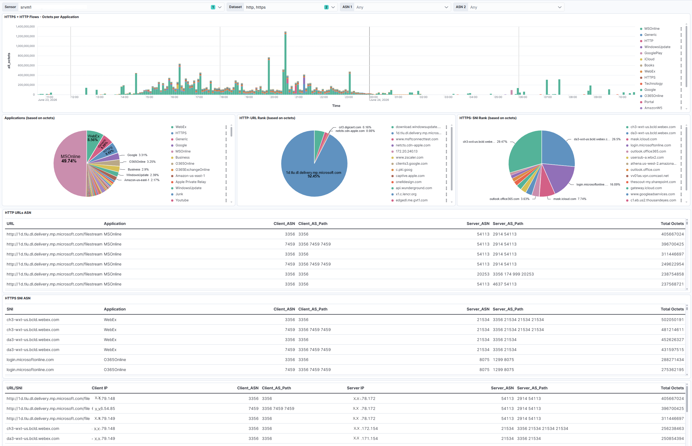

# HTTP/HTTPS Traffic Analytics with Elasticsearch, Logstash & Kibana

## Overview

An end-to-end network traffic analytics solution built to analyze **HTTP and HTTPS traffic** from a customer-provided PCAP.

The solution uses NETSCOUT probes to process the traffic, Logstash to enrich the resulting data, Elasticsearch for data storage and analysis, and Kibana for visualization.

---

## Data Flow

```text
Customer PCAP
     │
     ▼
NETSCOUT Probes
     │
     ▼
Traffic Data
     │
     ▼
Logstash
     │
     ├── Client IP → ASN + AS Path
     └── Server IP → ASN + AS Path
     │
     ▼
Elasticsearch
     │
     ▼
Kibana
     │
     ▼
Analytics & Dashboards
```

---

## Dashboard



> **Note:** The dashboard screenshot has been anonymized and contains no customer-sensitive or confidential information.

---

## Use Case

The objective was to create a detailed view of HTTP/HTTPS traffic and correlate **application-level information with network and Internet routing data**.

The dashboard allows traffic to be analyzed by:

* Applications
* URLs
* SNI / Server Name Indication
* Traffic volume
* Client ASN
* Client AS Path
* Server ASN
* Server AS Path

This makes it possible to investigate **which applications and URLs generate traffic and how that traffic is distributed across networks and Autonomous Systems**.

---

## Data Enrichment

One of the key elements of the solution was enrichment of both **client and server IP addresses**.

Using Logstash, I added:

| IP        | Enrichment    |
| --------- | ------------- |
| Client IP | ASN + AS Path |
| Server IP | ASN + AS Path |

This transformed the raw traffic data into a more useful network intelligence dataset, allowing traffic patterns to be analyzed at both the **IP level and Autonomous System level**.

---

## My Contribution

I designed the complete workflow from traffic capture to visualization, including:

* Processing the customer PCAP through NETSCOUT probes
* Defining the required traffic data
* Designing the Logstash enrichment workflow
* Enriching client and server IPs with ASN and AS Path
* Loading the processed data into Elasticsearch
* Designing Kibana visualizations
* Defining relevant KPIs and analytical dimensions
* Creating dashboards for application, URL, SNI and traffic analysis

---

## Technologies

**Data Collection**

`PCAP` · `NETSCOUT Probes`

**Data Processing**

`Logstash`

**Data Storage & Search**

`Elasticsearch`

**Visualization**

`Kibana`

**Data**

`HTTP` · `HTTPS` · `SNI` · `IP` · `ASN` · `AS Path`

---

## Skills Demonstrated

**Network Traffic Analysis** · **Data Enrichment** · **Logstash Pipelines** · **Elasticsearch** · **Kibana** · **Network Intelligence** · **Data Visualization** · **Technical Solution Design**
