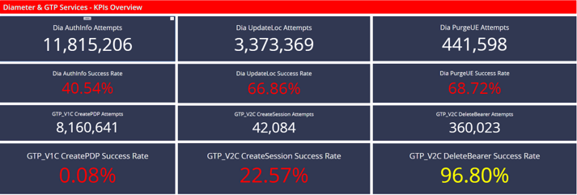
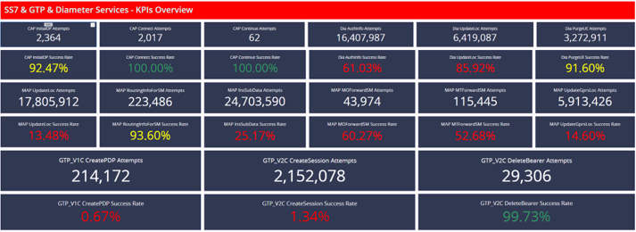
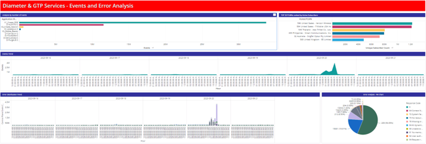
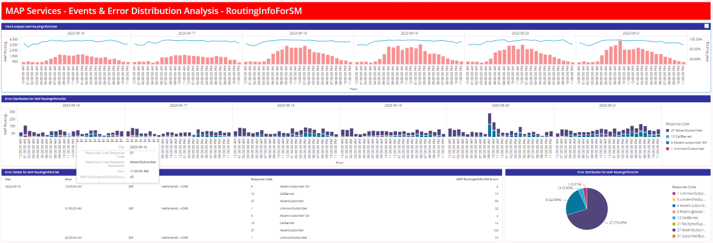

# MicroStrategy / nBA – PLMN Accounts Analysis

## Overview

A telecom analytics and reporting solution designed to analyze **PLMN roaming activity, application messages, success rates and errors**.

The dossier was built in **MicroStrategy** using NETSCOUT nBA data and provides separate analytical views for **Inbound and Outbound Roamers**.

The solution combines high-level KPI reporting with detailed signaling and error analysis, allowing users to move from an overall service view to individual application messages and response codes.

---

## Analysis Parameters

Users can control the scope of the analysis through interactive prompts.

**Time Period of Analysis**
Required input using predefined time-period filters.

**Subscriber IMSI**
Optional filter allowing the analysis to be narrowed down to a specific subscriber.

---

# Dashboard Views

## 1. Inbound Roamers – KPI Overview

The KPI Overview provides a high-level view of **Inbound Roamer signaling activity**, including:

* Number of Attempts
* Success Rates
* Key Application Messages
* Signaling activity and trends

This view provides an initial assessment of roaming performance before moving into detailed error analysis.

---

## 2. Outbound Roamers – KPI Overview

The Outbound Roamers view provides the equivalent high-level analysis for **Outbound PLMN activity**, allowing signaling performance and success rates to be monitored across key Application Messages.

---

## 3. Inbound PLMN – Error Analysis

The Error Analysis view provides a consolidated analysis of signaling errors, including:

* Application Message analysis by number of events
* Event trends by day and hour
* Error distribution trends by day and hour
* Error distribution by response code
* Error distribution visualization

This view helps identify the most significant error categories and when they occur.

---

## 4. MAP RoutingInfoForSM – Detailed Analysis

Each key Application Message has a dedicated detailed analysis page.

The **MAP RoutingInfoForSM** dashboard demonstrates the detailed drill-down available for individual signaling procedures.

The analysis includes:

* Event volume and trends
* Success Rate (%)
* Day / Hour analysis
* Error trends
* Response Code distribution
* HPLMN analysis
* Detailed error information

This allows technical teams to move from an overall KPI view to detailed analysis of a specific signaling procedure and its associated errors.

---

# Application Message Analysis

Separate detailed analysis pages were created for key Application Messages.

### Inbound PLMN

**CAP**

* InitialDP
* Connect
* Continue

**MAP**

* UpdateLocation
* RoutingInfoForSM
* InsSubData
* MOForwardSM
* MTForwardSM
* UpdateGprsLocation
* SendRoutingInfo

**Diameter**

* AuthenticationInfo
* UpdateLocation
* PurgeUE

**GTP**

* Create PDP
* Create Session
* Delete Bearer

### Outbound PLMN

**Diameter**

* AuthenticationInfo
* UpdateLocation
* PurgeUE

**GTP**

* Create PDP
* Create Session
* Delete Bearer

---

# Detailed Analysis Structure

For each Application Message, the detailed analysis provides:

### Event Trend Analysis

* Number of Events
* Success Rate (%)
* Day / Hour analysis
* Event trends over time

### Error Distribution

* Number of Errors
* Response Code distribution
* Day / Hour error trends

### Error Details

Detailed analysis by:

* HPLMN
* Response Code
* Number of Errors
* Day / Hour

This structure supports progressive drill-down from **high-level roaming KPIs → error analysis → individual signaling procedures → detailed error information**.

---

# My Contribution

I designed and built the MicroStrategy reporting solution, including:

* Designing the overall dossier structure
* Defining user prompts and analysis parameters
* Designing Inbound and Outbound Roamer KPI views
* Developing error analysis dashboards
* Creating detailed Application Message analysis pages
* Defining relevant telecom KPIs and visualizations
* Creating event and error trends by day and hour
* Designing response-code analysis
* Building detailed error tables by HPLMN and response code
* Organizing the dashboards to support progressive drill-down from KPIs to detailed signaling analysis

---

# Technologies

**Analytics Platform**

`NETSCOUT nBA`

**Reporting & Visualization**

`MicroStrategy`

**Telecom Signaling**

`CAP` · `MAP` · `Diameter` · `GTP`

**Analysis**

`PLMN` · `Roaming` · `HPLMN` · `IMSI` · `Application Messages` · `Response Codes`

---

# Skills Demonstrated

**Telecom Analytics · Roaming Analysis · Signaling Analytics · MicroStrategy · KPI Design · Dashboard Design · Error Analysis · Data Visualization · Drill-Down Analysis · Service Assurance**
