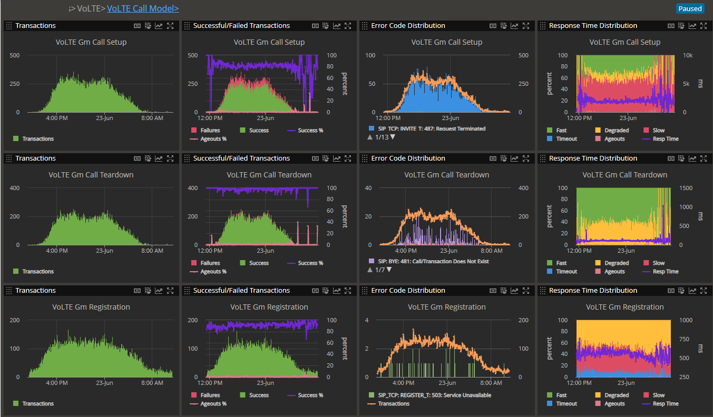
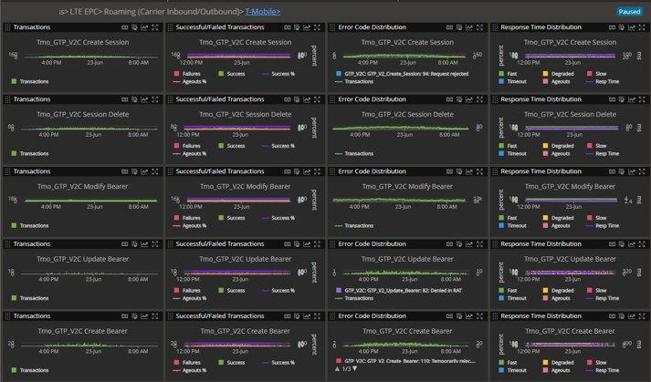
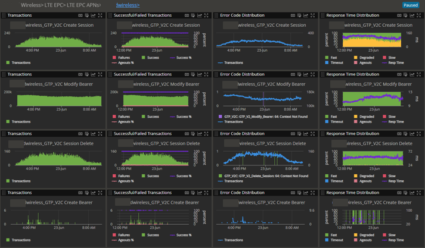
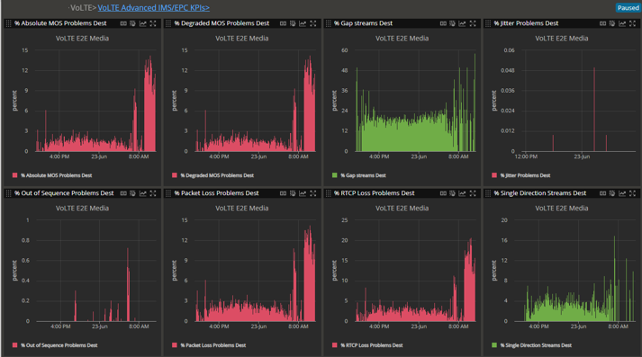

# NETSCOUT nGeniousONE – Telecom Analytics Dashboards

## Overview

A collection of telecom analytics dashboards designed and built using **NETSCOUT nGeniousONE** to monitor mobile network signaling, service performance and key operational KPIs.

The dashboards provide analytical views across **VoLTE, GTPv2 Control Plane, roaming and APN-specific traffic**.

---

## Dashboard 01 – VoLTE Call Model

### Objective

Provide an operational view of VoLTE signaling activity and call-related procedures.

### Key KPIs

* Call Setups
* Call Teardowns
* Registrations
* Signaling activity and trends

The dashboard provides a consolidated view of VoLTE activity, helping technical teams monitor service behavior and identify changes in signaling patterns.

---

## Dashboard 02 – Roaming – GTPv2 Control Plane

### Objective

Monitor GTPv2 Control Plane activity for a **T-Mobile roaming environment**, providing visibility into key session management procedures.

### Key KPIs

* Create Session
* Delete Session
* Create Bearer / Modify Bearer
* Update Bearer
* Traffic trends and signaling activity

The dashboard allows roaming-related signaling activity to be monitored and analyzed across key GTPv2 Control Plane procedures.

---

## Dashboard 03 – APN Analysis

### Objective

Provide a detailed view of GTPv2 Control Plane activity for a **specific APN**, allowing service-level traffic and signaling behavior to be analyzed.

### Key KPIs

* GTPv2 Control Plane activity
* Session-related procedures
* Traffic trends
* KPI trends for the selected APN

The dashboard provides a focused analytical view that can be used to investigate the behavior and performance of a specific service or APN.

---

## Dashboard 04 – User Plane Media Quality

### Objective

Provide an advanced view of **User Plane media quality** to identify problems affecting real-time media streams and understand their impact on service quality.

### Key KPIs

* % Absolute MOS Problems
* % Degraded MOS Problems
* % GAP Streams
* % Jitter Problems
* % Out-of-Sequence Problems
* % Packet Loss
* % RTCP Loss Problems
* % Single-Direction Streams

These KPIs provide visibility into different dimensions of media quality, allowing technical teams to identify degradation caused by packet loss, jitter, sequencing issues, asymmetric traffic and other conditions affecting real-time media streams.

### My Contribution

I designed and built the dashboard in nGeniousONE, selecting and organizing advanced User Plane KPIs to provide a consolidated view of media quality.

The dashboard enables technical teams to identify problematic streams, analyze the type and scale of media-quality issues, and support further troubleshooting and service assurance activities.

### Technologies

**Platform**

`NETSCOUT nGeniousONE`

**Network Area**

`User Plane` · `Media` · `Real-Time Communications`

**Analytics**

`MOS` · `Packet Loss` · `Jitter` · `RTCP` · `Stream Quality`

### Skills Demonstrated

**User Plane Analytics · Media Quality Analysis · Service Assurance · QoS Analysis · KPI Design · Network Troubleshooting · Telecom Analytics**

