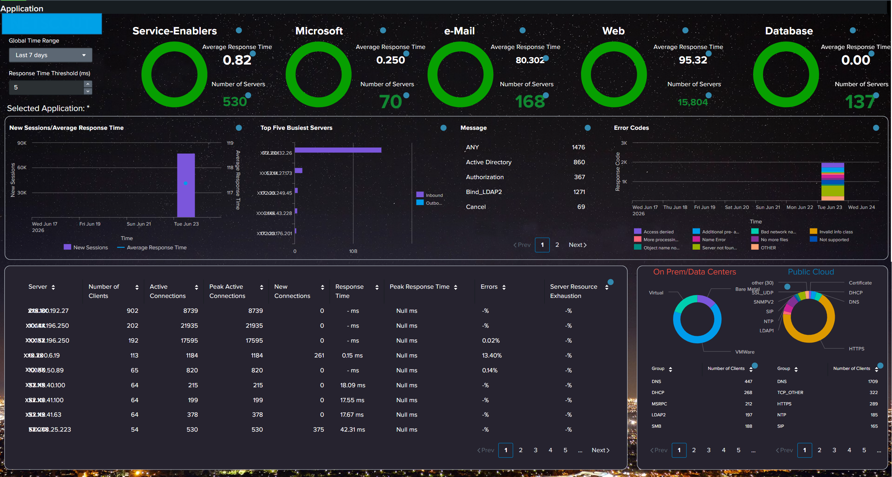
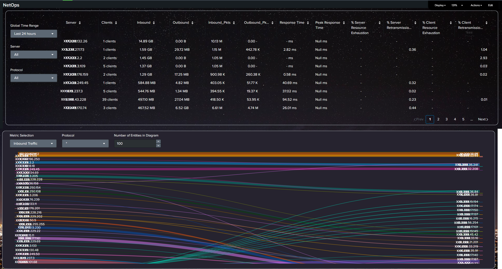

# Dashboard 01 – Application Monitoring

Example of an application monitoring dashboard designed to provide an operational overview of application health, performance and activity.

> **Note:** The screenshot has been anonymized and contains no customer-sensitive or confidential information.

## Dashboard

## Objective

The dashboard provides a centralized view of application performance and operational health, helping technical teams quickly identify abnormal behavior and investigate potential issues.

## Key areas

* Application health and availability
* Performance monitoring
* Application activity and trends
* Error and failure analysis
* Identification of abnormal behavior
* Troubleshooting and incident investigation

## My contribution

I designed the dashboard structure, selected relevant metrics and developed Splunk queries and visualizations to provide a clear operational view of the application.

The dashboard was designed with troubleshooting in mind, allowing technical teams to move from a high-level overview to more detailed analysis when investigating an issue.

## Technologies

* Splunk
* SPL
* JSON
* REST API
* Linux

## Skills demonstrated

**Observability · Application Monitoring · Log Analysis · Data Visualization · Troubleshooting · Incident Investigation**

# Dashboard 02 – NetOps Monitoring

### Objective

Provide a consolidated view of traffic and communication performance between clients and servers, helping NetOps teams monitor network behavior and identify performance issues.

### Key metrics

* Inbound / Outbound data volume
* Traffic peaks
* Retransmission rate
* Response time
* Traffic trends and patterns
* Client-to-server communication performance

### My contribution

I designed the dashboard to provide an operational view of client-to-server and server-to-client traffic, combining traffic volume and performance metrics in a single view.

The dashboard helps technical teams quickly identify traffic peaks, increased retransmissions, degraded response times and other abnormal patterns that may indicate network or application performance issues.

### Technologies

* Splunk
* SPL
* JSON
* REST API
* Linux

### Skills demonstrated

**Network Traffic Analysis · NetOps Monitoring · Performance Monitoring · KPI Analysis · Anomaly Detection · Troubleshooting**
